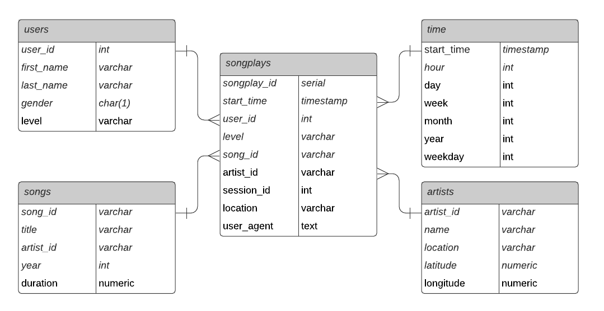

# 1) Introduction

The startup company Sparkify launched a new music streaming app and wants to get insights about the music preferences of their users, in particular Sparkify wants to understand what songs users are listening to.

The goal of this project is to build a consistent Postgres database which will serve as a single source of truth for data analysis. A Python ETL pipeline is designed to update the Postgres database with the collected data which currently resides in a directory of JSON logs on user activity, as well as a directory with JSON metadata on the songs.

# 2) Repository
### Structure:

**Folder:**
- data
    - log_data
    - song_data
- images

**Files:**
- create_tables.py
- etl.ipynb
- etl.py
- README.md
- sql_queries.py
- test.ipynb

### Explanation:
#### Folders:
- The data folder contains the source JSON log_data and JSON song_data collected from the app. 
- The images folder contains the datamodel ER diagram displayed in this README.md.

#### Files:
- **create_tables.py:** *python script to create the Postgres Database "sparkifydb" with relevant tables.*
- **etl.ipynb:** *ipython ETL script for development purposes only.*
- **etl.py:** *python ETL script which reads the JSON sourcefiles and inserts it into the "sparkifydb" Postgres Database.*
- **README.md** *describes the project.*
- **sql_queries.py:** *SQL file which includes create/drop table and insert statements used in the database creation and ETL process.*
- **text.ipynb:** *ipython script to retrieve sample data from Posgres Database which can be used to verify the success of the ETL process*

# 3) Database Schema
The purpose of the "sparkifydb" database is data analysis, hence a dimensional model (STAR Schema) is used to allow for optimized data reading and data aggregation.

### Benefits of the STAR Schema
- Simplifies Queries (less joins needed)
- Faster Aggregation (e. g. sums, counts)
- Easy to understand

### Tables
The schema includes the following tables and fields:  
#### Fact Table
***songplays***
- songplay_id
- start_time
- user_id
- level
- song_id
- artist_id
- session_id
- location
- user_agent

#### Dimension Tables
***users***
- user_id
- first_name
- last_name
- gender
- level

***songs***
- song_id
- title
- artist_id
- year
- duration

***artists***
- artist_id
- name
- location
- latitude
- longitude

***time***
- start_time
- hour
- day
- week
- month
- year
- weekday

### Datamodel

# 4) ETL Pipeline
### Installation
The following items must be installed prior to execution:
- Postgres Database
- Python
- Python Libraries:
    - psycopg2
    - pandas

### Execution
This section explains the execution of the ETL pipeline.
The python scripts can be run from a terminal and must be executed in the following order.

1. create_tables.py
- creates Postgres database "sparkifydb"
- drops/creates tables as mentioned in section "Database Schema" using sql_queries.py
- after successful creation the script prints "Process suceeded"; in case of an error the process prints "Process failed"
- make sure to run this script always prior to execution of etl.py

2. etl.py
- script reads data from sourcfiles and writes data into the database tables
- script uses file sql_queries.py containing the table insert statements
- script prints the count and processed files for monitoring the execution

3. test.py (optional)
- script can be used to verify the data in the database schema

### 5) Ressources
This section lists additional ressources used:
- Data Engineering with Python (Packt Book) on Postgres insertmany
- https://www.postgresqltutorial.com/postgresql-python/insert on Postgres error handling